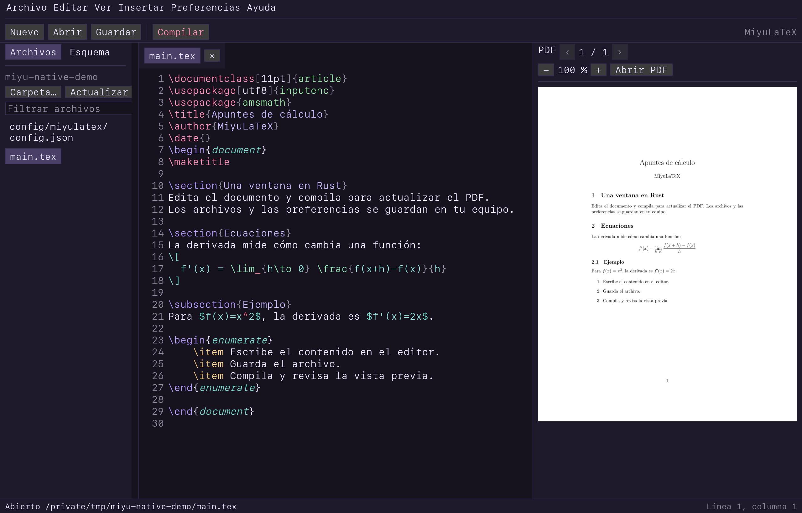

# MiyuLaTeX

Editor de LaTeX, Markdown y código escrito en Rust. Abre una ventana gráfica
con egui, controles con la fuente del sistema, código monoespaciado y bordes finos. Incluye
compilación LaTeX, vista previa de Markdown y un visor de PDF e imágenes.



## Ejecutar

```sh
cargo run --release
cargo run --release -- examples/articulo.tex
cargo run --release -- README.md
cargo run --release -- src/main.rs
cargo run --release -- examples/articulo.pdf
```

Estos comandos abren una ventana. También puedes crear la app macOS y abrirla
desde Finder, sin usar una terminal:

```sh
sh scripts/package-macos.sh
open dist/MiyuLaTeX.app
```

El paquete incluye el icono de `assets/icon.png`, convertido a
`assets/icon.icns`. Puedes copiar `dist/MiyuLaTeX.app` a Aplicaciones.

Para compilar documentos LaTeX necesitas un motor LaTeX. Miyu detecta `tectonic`, `latexmk`, `pdflatex`,
`xelatex` y `lualatex`, en ese orden. Puedes elegir uno en Preferencias.

```sh
brew install tectonic
```

Para `biblatex` con `backend=biber`, Tectonic 0.17 exige biber 2.17, que
corresponde a su biblatex 3.17. El de Homebrew es más nuevo y no sirve. Pon el
binario de la [versión 2.17](https://sourceforge.net/projects/biblatex-biber/files/biblatex-biber/2.17/binaries/)
en `~/.config/miyulatex/bin/biber`. Miyu busca ahí antes que en el `PATH`. En
macOS reciente el binario universal no arranca; extrae tu arquitectura con
`lipo biber -thin arm64 -output biber`.

Con Tectonic, Miyu lee el registro de LaTeX y el de biber para mostrar las
citas y referencias sin resolver, con el archivo y la línea donde aparecen.

## Uso

Nuevo documento abre un archivo sin guardar. Nuevo proyecto crea una carpeta,
y Abrir proyecto permite elegir una carpeta existente. Abrir archivo acepta
texto, código, PDF e imágenes. También puedes arrastrarlos a la ventana.
Los botones explican su acción al pasar el cursor. Las acciones que requieren
un documento editable, un PDF o una compilación en curso se desactivan cuando
no están disponibles. Los archivos y el esquema están a la izquierda,
las pestañas del editor en el centro y la vista previa a la derecha. El menú Ver
permite ocultar cada panel o pasarlo al otro lado de la ventana. En ventanas
estrechas, el panel lateral se abre en una ventana para conservar su acceso. Los
problemas de compilación abren el archivo en la línea correspondiente.

Nuevo proyecto, en la barra de herramientas o en Archivo, crea una carpeta
con el nombre y la ubicación que elijas. Puedes dejarla vacía, usar una
plantilla LaTeX o crear un archivo de código vacío para Python, Rust,
JavaScript, TypeScript, C, C++ o Go. El proyecto se abre al crearlo y aparece
en los recientes. Las pestañas abiertas se conservan. Si la carpeta ya existe,
el diálogo pide otro nombre.

Markdown tiene vista previa mientras escribes, tablas, listas de tareas,
enlaces, imágenes locales y bloques de código. El esquema muestra los títulos
y permite saltar a ellos. Los enlaces a otros archivos locales abren una
pestaña. `Cmd+B` y `Cmd+I` insertan el formato de Markdown. Enter continúa las
listas y deja una casilla nueva sin marcar.

Los archivos de código usan las gramáticas de Syntect para resaltado. Incluye
Rust, Python, JavaScript, C, C++, Java, Go, SQL, HTML, CSS, JSON y YAML, entre
otros. `Cmd+/` usa los comentarios del lenguaje cuando tiene un marcador
definido. JSON no admite comentarios. Los archivos UTF-8 sin una gramática
conocida se editan como texto. Guardar como conserva la extensión y cambia el
resaltado según el nuevo nombre. Se conservan los saltos de línea de Windows.

El editor detecta la sangría del archivo y la usa al pulsar Tab o Enter.
Mayús+Tab quita un nivel. Las guías de sangría se activan en Preferencias.
El esquema lista funciones, clases y tipos. El completado es local y depende
del lenguaje: ofrece las palabras del documento (las más cercanas primero),
las palabras clave y la biblioteca que traen las gramáticas del resaltado, los
miembros habituales tras un punto y plantillas como `for`, `main` o `class`.
Las flechas eligen una sugerencia, Tab la inserta y Esc cierra la lista;
Ctrl+Espacio la abre sin haber escrito nada. Copiar o cortar sin selección toma la línea
entera. Deshacer agrupa las letras escritas seguidas.

Buscar resalta las coincidencias y muestra la posición actual. Enter y
Mayús+Enter avanzan o retroceden desde el campo de búsqueda, y Esc lo cierra.
`Aa` distingue mayúsculas, `ab` busca palabras completas y `.*` permite
expresiones regulares. Sin `Aa`, escribir una mayúscula también hace la
búsqueda exacta. Reemplazar coincidencia cambia solo la coincidencia seleccionada y avanza.
Reemplazar todas cambia todas las coincidencias del documento activo y permite
deshacerlas en un paso. Ambos botones se desactivan si no hay coincidencias.

Los PDF se abren en pestañas de solo lectura. Las páginas van seguidas en una
columna que se recorre con la rueda o el trackpad. El zoom se ajusta con los
botones, con el gesto de pellizco o con `Cmd` y la rueda. Ajustar vuelve al
ancho del panel. Cada página se rasteriza a la resolución de la pantalla y solo
cuando se ve. Al recompilar se conserva la posición. Cada pestaña conserva su
página y su zoom. También puedes ver PNG, JPEG, WebP, GIF y BMP. La compilación automática
solo se aplica a LaTeX. PDF e imágenes no pasan por el guardado de texto.

El diálogo Nuevo documento permite crear LaTeX, bibliografía, Markdown, texto,
Python, Rust, JavaScript, TypeScript, C, C++ y Go, además de las plantillas LaTeX.
Abre y guarda otros lenguajes con su extensión.

| Tecla en macOS | Acción |
| --- | --- |
| `Cmd+N` | Nuevo documento desde plantilla |
| `Cmd+Shift+N` | Crear una carpeta de proyecto |
| `Cmd+O` | Abrir archivo con el diálogo del sistema |
| `Cmd+S` / `Cmd+Shift+S` | Guardar / guardar como |
| `Cmd+W` / `Ctrl+Tab` | Cerrar / cambiar pestaña |
| `F5` / `Cmd+R` | Guardar los documentos LaTeX y compilar |
| `F6` | Abrir el PDF en el visor del sistema |
| `F2` / `F3` / `F4` | Mostrar archivos, vista previa o problemas |
| `Cmd+F` / `Cmd+G` | Buscar y reemplazar / ir a línea |
| `Cmd+Shift+F` | Buscar en el proyecto |
| `Cmd+Shift+O` | Abrir rápido un archivo del proyecto |
| `Cmd+Shift+J` | Mostrar en el PDF la línea del cursor |
| `Cmd+T` | Insertar un símbolo LaTeX |
| `Cmd+B` / `Cmd+I` / `Cmd+/` | Negrita, cursiva o comentar líneas |
| `Tab` / `Shift+Tab` | Completar o añadir sangría / quitar sangría |
| `Ctrl+Espacio` | Mostrar sugerencias |
| `Alt+↑` / `Alt+↓` | Subir / bajar las líneas seleccionadas |
| `Cmd+Shift+D` / `Alt+Shift+↓` | Duplicar las líneas seleccionadas |
| `Cmd+Shift+K` / `Cmd+L` | Borrar / seleccionar líneas enteras |
| `Cmd+Enter` / `Cmd+Shift+Enter` | Abrir una línea debajo / encima |
| `Cmd+D` | Seleccionar la palabra o su siguiente aparición |
| `Cmd+Shift+\` / `Ctrl+M` | Ir al corchete emparejado |
| `Cmd+Z` / `Cmd+Shift+Z` | Deshacer / rehacer |
| `Cmd+C` / `Cmd+X` / `Cmd+V` | Copiar, cortar y pegar |
| `Cmd+P` / `Cmd+,` | Preferencias |
| `F1` / `Cmd+Q` | Ayuda / salir |

En otras plataformas, usa `Ctrl` en lugar de `Cmd`.

En archivos LaTeX, el editor resalta la sintaxis, cierra pares y conserva la sangría. Autocompleta 186
comandos, 37 entornos, etiquetas y citas. `Tab` acepta una sugerencia.
`\begin{` permite insertar el cuerpo y el cierre del entorno. Hay seis
plantillas y 101 símbolos en los catálogos integrados.

La compilación y el renderizado del PDF corren en hilos separados. Hay un
límite de 240 segundos para compilar. Se respeta `% !TEX root = ../main.tex`.
El guardado escribe en un archivo temporal y lo renombra al terminar. Si otro
programa cambia el archivo, Miyu rechaza el guardado para evitar sobrescribirlo.
Al cerrar un documento modificado, pide guardar o descartar los cambios.

## Proyectos LaTeX

Archivo importa y exporta el proyecto como ZIP, compatible con Overleaf, y
exporta el PDF compilado. Añadir archivos copia imágenes, bibliografías u
otros fuentes a la carpeta del proyecto.

El panel Referencias lista las etiquetas y las citas de todo el proyecto para
insertarlas con `\ref` o `\cite`. Insertar tiene asistentes de tabla y figura,
además de los entornos del catálogo. Buscar en el proyecto recorre los archivos de texto e incluye los cambios
abiertos sin guardar. Cada resultado abre el archivo en su línea.

El menú LaTeX permite detener la compilación, recompilar desde cero, limpiar
archivos auxiliares, compilar al dejar de escribir y guardar automáticamente.
Detener compilación sigue disponible al cambiar de pestaña. Configurar proyecto
LaTeX abre una ventana dedicada al archivo principal y al motor de esa carpeta.
Preferencias conserva los ajustes generales del editor y la apariencia. Contar palabras usa `texcount`
si está instalado y, si no, una estimación propia.

Mostrar esta línea en el PDF (`Cmd+Shift+J`) lleva del código a la página y
resalta la línea. Un doble clic o `Cmd`+clic en el PDF abre el archivo y la
línea de origen. Miyu lee el `.synctex.gz` que deja la compilación, sin el
programa `synctex`, así que funciona con Tectonic solo.

Cada guardado deja una versión en `~/.config/miyulatex/history`. Historial del archivo LaTeX, en Archivo, muestra las últimas 100 y restaura
cualquiera en el editor.

## Sesión y archivos

Sin argumentos, Miyu vuelve al proyecto y a las pestañas de la última vez.
`miyu .` abre la carpeta actual. Se desactiva en Preferencias. Archivo guarda
los diez proyectos recientes.

Abrir rápido (`Cmd+Shift+O`) busca entre los archivos del proyecto por
cualquier parte del nombre o por sus letras en orden.

Archivos muestra el proyecto como un árbol de carpetas que se pliegan con un
clic. El filtro deja solo las carpetas con coincidencias. Crear archivo crea un archivo dentro del proyecto. Puedes elegir cualquier
formato por su extensión. Sin extensión, crea texto con `.txt`. Añadir archivos
copia archivos existentes y Actualizar lista vuelve a leer la carpeta. El clic derecho sobre un archivo permite renombrarlo,
duplicarlo, mostrarlo en su carpeta y copiar su ruta. Sobre una carpeta, crea
un archivo dentro de ella.

Si otro programa cambia un archivo abierto, Miyu lo recarga al volver a la
ventana. Deshacer recupera el texto anterior. Si además tenías cambios sin
guardar, pregunta si recargar o conservar tu versión.

## Ortografía

En macOS, el editor subraya las palabras que no están en el diccionario del
sistema. Revisa la prosa de LaTeX, Markdown y texto. Deja fuera comandos,
matemáticas, comentarios, claves de citas y referencias, rutas y el preámbulo.
El clic derecho sobre una palabra subrayada ofrece sugerencias, la añade al
diccionario o la ignora durante la sesión. El idioma se elige en Preferencias
y por defecto es español.

## Personalización

Preferencias tiene dos secciones plegables, Editor y Apariencia.

Editor permite elegir la fuente entre todas las familias instaladas en el
equipo, con buscador y filtro de monoespaciadas, o desde un archivo TTF, OTF
o TTC. También ajusta el tamaño del código, el interlineado y los espacios
por sangría. También muestra u oculta los números de línea, resalta la línea
actual, activa el cierre de pares y las sugerencias, y ajusta la espera antes
de compilar.

Apariencia cambia el tamaño del texto de la interfaz y el redondeo de las
esquinas. Los colores propios sustituyen el primario, el secundario, el
acento, el fondo y el texto del tema elegido. Con una foto de fondo puedes
ajustar el tamaño del punto y la sombra bajo el texto, que mantiene legible
el código sobre la foto en temas claros y oscuros.

Sobre la barra de estado vive un gatito de píxeles: pasea, parpadea, mueve
la cola, se duerme tras un minuto sin actividad y salta cuando la compilación
sale bien o le haces clic. Se oculta con clic derecho sobre él, en Ver o en
Apariencia.

## Fondo tramado

En Preferencias puedes elegir una foto, ajustar la intensidad, usar sus
colores como tema y alternar entre tramado y liso.

El tramado usa la fórmula de `BetterThanEminus/src/bg.js`, con matriz Bayer
8 por 8, luminancia ponderada, contraste contra el fondo, atenuación vertical
y redondeo del canvas. La ventana dibuja puntos de dos píxeles lógicos,
también en Retina, y usa muestreo Nearest para conservarlos. El encuadre
cubre el 95 % de la altura.

La prueba de referencia compara 1.292 píxeles de temas claros y oscuros en
ambos estilos. Para regenerarla desde el proyecto de referencia:

```sh
node tests/tramado_reference.mjs ../BetterThanEminus/src/bg.js
cargo test matches_better_than_eminus
```

## Desarrollo

Las preferencias viven en `~/.config/miyulatex/config.json`. Se respeta
`XDG_CONFIG_HOME` y se conserva el formato de la versión Python. Los fondos se
copian a la subcarpeta `backgrounds`. La versión anterior está en `python/`.
El ejecutable Rust no necesita Python.

```sh
cargo test
cargo clippy --all-targets -- -D warnings
cargo fmt --check
```

Las pruebas usan una carpeta de preferencias temporal y no tocan la real.

Las pruebas de integración de egui simulan edición Unicode, deshacer, pares,
autocompletado, guardado y protección de cambios externos. También verifican
Markdown, comentarios de código, apertura de PDF e imágenes, navegación de
páginas y protección de archivos binarios. Si Tectonic está
instalado, también compila un documento real y verifica el PDF de la ventana.

Puedes rasterizar fuera de la interfaz para revisar resultados:

```sh
miyu --render-pdf documento.pdf pagina.png 1
miyu --render-background foto.png fondo.png 1280 800 2 1 16131f dither
```

`app.rs` dibuja la ventana y maneja los eventos. `editor.rs` edita texto,
`highlight.rs` resalta LaTeX, `syntax.rs` mantiene el resaltado por líneas y
`layout.rs` maqueta solo las que cambian. `format.rs` detecta formatos y extrae
el esquema de Markdown, `latex.rs` reúne fuentes, etiquetas, citas, historial y
ZIP del proyecto, `compiler.rs` compila y lee problemas, `synctex.rs` relaciona
el código con el PDF, `preview.rs` rasteriza y dibuja el PDF, `spell.rs` revisa
la ortografía, `workspace.rs` lleva la sesión y los archivos, `backdrop.rs` trama la foto, `theme.rs` define
los temas, `custom.rs` aplica la personalización y `config.rs` guarda
preferencias. `snippets.json` conserva los catálogos de la versión Python.

## Licencia

[MIT](LICENSE).
